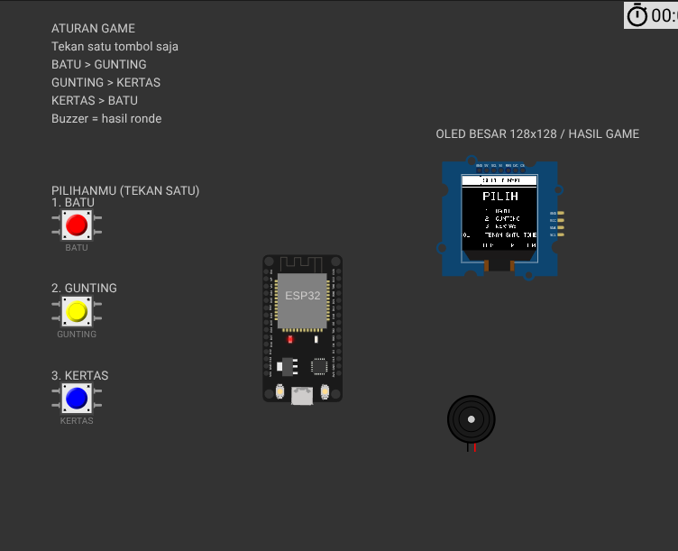

# Suit TinyML ESP32

Game batu–gunting–kertas berbasis ESP32 untuk mempelajari alur deployment TinyML. Pemain cukup menekan satu tombol **BATU**, **GUNTING**, atau **KERTAS**. Model TensorFlow Lite Micro membaca encoding tombol, ESP32 memilih langkah lawan, lalu OLED SH1107 128×128 menampilkan hasil dan skor.

Model siap pakai sudah tersedia. Anda **tidak perlu melakukan training** untuk memainkan game.



*Panduan singkat: mulai simulasi, pilih satu tombol, lalu lihat hasil pada OLED. Kabel sengaja tidak ditampilkan, tetapi seluruh koneksi tetap aktif.*

## Instalasi dependency

Dependency game dan dependency training dipisahkan agar pengguna yang hanya ingin bermain tidak perlu mengunduh TensorFlow berukuran besar.

### Hanya bermain di Wokwi browser

Tidak perlu memasang Python, TensorFlow, atau PlatformIO. Siapkan proyek menggunakan file dalam folder `wokwi/`, lalu ikuti bagian **Pilihan A** di bawah.

### Build dan simulasi dari komputer

Pasang [Python](https://www.python.org/downloads/) dan [VS Code](https://code.visualstudio.com/), kemudian pasang extension **PlatformIO IDE** dan **Wokwi Simulator** melalui menu Extensions VS Code. PlatformIO IDE sudah membawa PlatformIO Core sendiri; instalasi Core global tidak diperlukan.

Proyek juga menyediakan instalasi PlatformIO terisolasi yang dapat dijalankan dari terminal:

```bash
python3 tools/build_local.py
```

Script akan membuat `.build-env/`, memasang PlatformIO 6.1.19, mengunduh library ESP32 melalui cache standar PlatformIO milik pengguna, mengompilasi firmware, dan menaruh hasil di `firmware/`. Jangan menggunakan `sudo`.

### Training dan pengujian model

Gunakan Python 3.10–3.12. Contoh Linux/macOS:

```bash
python3.11 -m venv .venv
source .venv/bin/activate
python -m pip install --upgrade pip
python -m pip install -r training/requirements.txt
python -c "import tensorflow as tf; print(tf.__version__)"
```

Windows PowerShell:

```powershell
py -3.11 -m venv .venv
.venv\Scripts\Activate.ps1
python -m pip install --upgrade pip
python -m pip install -r training/requirements.txt
python -c "import tensorflow as tf; print(tf.__version__)"
```

Jika perintah terakhir menampilkan `2.17.1`, dependency training sudah siap. Folder `.venv/` dan `.build-env/` bersifat lokal, tidak perlu dikirim bersama source, dan sudah tercantum di `.gitignore`.

## Menjalankan game

### Pilihan A — Wokwi di browser

1. Buka proyek ESP32 Arduino baru di [Wokwi](https://wokwi.com/projects/new/esp32).
2. Masukkan isi folder `wokwi/` ke proyek:
   - `sketch.ino`
   - `game_logic.h`
   - `model_data.h`
   - `libraries.txt`
3. Ganti `diagram.json` proyek Wokwi dengan isi `wokwi/diagram.json`.
4. Tekan tombol **Start Simulation** berwarna hijau.
5. Setelah OLED menampilkan `PILIH`, klik tombol berwarna atau tekan angka pada keyboard:
   - `1` / merah: BATU
   - `2` / kuning: GUNTING
   - `3` / biru: KERTAS

Setiap tekanan memainkan satu ronde. OLED menampilkan pilihan pemain, pilihan CPU, hasil, serta skor menang/kalah/seri. Buzzer berbunyi sesaat sebagai penanda hasil.

### Pilihan B — dari folder lokal dengan VS Code

Persyaratan jika tidak memakai script instalasi otomatis:

- Python 3.10 atau lebih baru
- VS Code
- extension **PlatformIO IDE**
- extension **Wokwi Simulator** jika ingin simulasi dari VS Code

Dari terminal di root proyek:

```bash
python3 tools/build_local.py --check
python3 tools/build_local.py
```

Di Windows, gunakan `py` sebagai pengganti `python3`. Perintah kedua membuat environment build lokal, memasang PlatformIO, mengompilasi firmware, lalu menaruh hasilnya di `firmware/`. Unduhan dependency memerlukan internet dan build pertama dapat memakan waktu beberapa menit.

Untuk simulasi, buka folder proyek di VS Code, jalankan **Wokwi: Start Simulator**, lalu tekan tombol pada diagram. Konfigurasi simulator menggunakan `wokwi.toml` dan hasil build `.pio/build/esp32dev/`.

Alternatif jika PlatformIO sudah terpasang:

```bash
pio run -e esp32dev
```

### Perangkat ESP32 fisik

Rangkaian menggunakan pin berikut:

| Komponen | Pin ESP32 |
|---|---:|
| Tombol BATU | GPIO 25 |
| Tombol GUNTING | GPIO 26 |
| Tombol KERTAS | GPIO 27 |
| Buzzer | GPIO 18 |
| OLED SDA | GPIO 21 |
| OLED SCL | GPIO 22 |
| OLED | 3.3 V dan GND |

Tombol menggunakan `INPUT_PULLUP`, sehingga satu kaki tombol terhubung ke GPIO dan kaki lainnya ke GND. Jangan memberi tegangan 5 V langsung ke GPIO ESP32.

## Tentang kabel yang tidak terlihat

Semua kabel pada diagram sengaja disembunyikan agar tampilan rapi. Koneksinya tetap aktif di `diagram.json`; warna kabel kosong hanya memengaruhi visual. OLED tetap tersambung ke 3.3 V, GND, SDA GPIO 21, dan SCL GPIO 22.

File `diagram.json` di root dipakai oleh Wokwi VS Code, sedangkan `wokwi/diagram.json` dipakai untuk proyek browser. Keduanya harus selalu identik.

## Aturan permainan

- Batu mengalahkan gunting.
- Gunting mengalahkan kertas.
- Kertas mengalahkan batu.
- Pilihan yang sama menghasilkan seri.
- Skor disimpan di RAM dan kembali ke nol setelah ESP32 direstart.
- Ketik `r` pada Serial Monitor 115200 baud untuk mereset skor tanpa restart.

Tidak ada pemetaan telunjuk, jari tengah, atau jari manis. Input permainan sepenuhnya berasal dari tiga tombol berlabel.

## Struktur proyek

```text
.
├── data/
│   └── dataset_sintetis.csv       # Dataset training yang dapat direproduksi
├── models/
│   ├── suit.keras                 # Model untuk evaluasi/training lanjutan
│   └── suit_float32.tflite        # Model yang diekspor untuk inference
├── tests/
│   ├── test_game.cpp              # Uji aturan game dan debounce
│   └── verify_model.py            # Uji model, dataset, dan header firmware
├── tools/
│   └── build_local.py             # Pemeriksaan dan build PlatformIO
├── training/
│   ├── Training_Suit_TinyML.ipynb # Notebook Colab/Jupyter
│   ├── requirements.txt           # Dependensi training lokal
│   └── train.py                   # Satu-satunya sumber pipeline training
├── wokwi/
│   ├── diagram.json               # Tata letak dan koneksi komponen
│   ├── game_logic.h               # Aturan game dan debounce
│   ├── libraries.txt              # Library untuk Wokwi browser
│   ├── model_data.h               # Model TFLite dalam array C++
│   └── sketch.ino                 # Firmware utama
├── diagram.json                   # Salinan diagram untuk Wokwi VS Code
├── platformio.ini                 # Konfigurasi build ESP32
├── wokwi.toml                     # Konfigurasi simulator lokal
└── README.md
```

Folder `.venv/`, `.build-env/`, `.pio/`, `firmware/`, dan `reports/` adalah hasil proses yang dapat dibuat ulang dan tidak perlu dimasukkan ke version control.

## Training model

Training hanya diperlukan jika ingin mempelajari atau mengubah model. Dataset bersifat sintetis dan menggambarkan encoding tombol, bukan pengukuran jari, kamera, atau sensor tangan nyata.

### Training lokal

Gunakan Python 3.10–3.12 dari root proyek:

```bash
python3 -m venv .venv
source .venv/bin/activate
python -m pip install --upgrade pip
python -m pip install -r training/requirements.txt
python training/train.py --out . --epochs 180
python tests/verify_model.py
```

Aktivasi Windows PowerShell:

```powershell
py -m venv .venv
.venv\Scripts\Activate.ps1
python -m pip install --upgrade pip
python -m pip install -r training/requirements.txt
python training/train.py --out . --epochs 180
python tests/verify_model.py
```

Training akan memperbarui dataset, model Keras, model TFLite, `wokwi/model_data.h`, dan laporan pada folder `reports/`. Untuk eksperimen tanpa menimpa model proyek, gunakan output terpisah:

```bash
python training/train.py --out hasil_eksperimen --epochs 180
```

### Training dengan Google Colab

1. Unggah `training/Training_Suit_TinyML.ipynb` ke Google Colab.
2. Pilih **Runtime → Run all**.
3. Saat diminta, unggah `training/train.py`.
4. Tunggu training dan verifikasi selesai.
5. Unduh `hasil_training_suit.zip` yang dibuat notebook.
6. Jika model baru akan dipakai game, salin `suit_output/wokwi/model_data.h` di Colab—atau `wokwi/model_data.h` dari ZIP yang sudah diekstrak—ke `wokwi/model_data.h` proyek, lalu build ulang firmware.

Notebook tidak menyimpan salinan pipeline sendiri; notebook memanggil `train.py` agar implementasi lokal dan Colab selalu sama.

### Menjalankan notebook secara lokal

Setelah environment `.venv` aktif, JupyterLab dapat dipasang dan dijalankan dari root proyek:

```bash
python -m pip install jupyterlab
python -m jupyter lab training/Training_Suit_TinyML.ipynb
```

Di JupyterLab pilih **Run → Run All Cells**. Notebook otomatis menemukan `training/train.py`, menulis hasil eksperimen ke `suit_output/`, memverifikasi model, dan membuat `hasil_training_suit.zip`.

## Status verifikasi proyek

Pemeriksaan berikut telah dijalankan pada environment lokal proyek:

| Pemeriksaan | Hasil |
|---|---:|
| TensorFlow / NumPy | 2.17.1 / 1.26.4 |
| Seluruh code cell notebook | LULUS |
| Akurasi model hasil training | 99,4% |
| Kesepakatan kelas Keras–TFLite | 100% |
| Build PlatformIO ESP32 | LULUS |
| Penggunaan RAM firmware | 39.092 byte / 11,9% |
| Penggunaan flash firmware | 362.149 byte / 11,5% |

Build berhasil menghasilkan `firmware/firmware.bin`, `firmware/firmware.elf`, `firmware/bootloader.bin`, dan `firmware/partitions.bin`. Hasil build membuktikan source dan library dapat dikompilasi; pengujian interaksi visual tetap dilakukan di Wokwi atau perangkat fisik.

## Pengujian

Pemeriksaan ringan tanpa mengunduh dependency:

```bash
python3 tools/build_local.py --check
```

Uji aturan game jika compiler C++ tersedia:

```bash
g++ -std=c++17 -Wall -Wextra -pedantic tests/test_game.cpp -o /tmp/test_suit
/tmp/test_suit
```

Uji model setelah dependency training terpasang:

```bash
python tests/verify_model.py
```

Verifikasi model memeriksa bentuk dan tipe tensor, prediksi pola utama, pemisahan data train/validation/test, serta memastikan byte `model_data.h` identik dengan file `.tflite`.

## Pemecahan masalah

**OLED kosong**

- Tunggu hingga kompilasi dan simulator benar-benar berjalan.
- Pastikan library pada `wokwi/libraries.txt` tersedia.
- Pastikan alamat OLED `0x3C`, SDA GPIO 21, dan SCL GPIO 22.
- Kabel tetap terhubung meskipun tidak digambar di layar.

**Build berhenti saat memasang package**

- Periksa koneksi internet.
- Jalankan ulang `python3 tools/build_local.py`.
- Hapus cache build hanya jika benar-benar rusak; folder tersebut akan dibuat ulang otomatis.

**Notebook gagal menemukan `train.py`**

- Jalankan sel secara berurutan.
- Ketika dialog upload muncul, pilih file `training/train.py`, bukan notebooknya.

**Editor menampilkan `Cannot find module google.colab`**

- `google.colab` hanya tersedia di server Google Colab dan tidak perlu dipasang pada komputer lokal.
- Notebook menggunakan import dinamis sehingga mode lokal tidak memuat modul Colab.
- Di VS Code pilih **Python: Select Interpreter**, lalu gunakan `.venv/bin/python` pada Linux/macOS atau `.venv\Scripts\python.exe` pada Windows.
- Jika peringatan masih tersimpan setelah mengganti interpreter, jalankan **Developer: Reload Window**.

**TensorFlow tidak dapat dipasang**

- Pastikan Python yang dipakai berada pada versi 3.10–3.12 dan environment virtual aktif.
- Gunakan Google Colab jika platform lokal tidak menyediakan wheel TensorFlow yang cocok.

## Catatan teknis

Model memiliki 3 input, hidden layer 24 dan 16 neuron ReLU, serta 4 output softmax: BATU, GUNTING, KERTAS, dan TIDAK_VALID. Firmware mendaftarkan operator `FULLY_CONNECTED` dan `SOFTMAX`, lalu menolak hasil yang tidak valid atau memiliki skor di bawah 0,75.

Karena masalah ini dapat diselesaikan dengan aturan biasa, TinyML digunakan sebagai sarana belajar pipeline data → training → konversi TFLite → inference pada mikrokontroler. Model ini tidak boleh dianggap sebagai model pengenalan gestur tangan dunia nyata.

## Referensi

- [Python `venv`](https://docs.python.org/3/tutorial/venv.html)
- [Instalasi TensorFlow dengan pip](https://www.tensorflow.org/install/pip)
- [Instalasi JupyterLab](https://jupyter.org/install)
- [PlatformIO IDE untuk VS Code](https://docs.platformio.org/en/latest/integration/ide/vscode.html)
- [Instalasi PlatformIO Core](https://docs.platformio.org/en/latest/core/installation/)
- [Memulai Wokwi untuk VS Code](https://docs.wokwi.com/vscode/getting-started)
- [Konfigurasi `wokwi.toml`](https://docs.wokwi.com/vscode/project-config)
- [LiteRT for Microcontrollers](https://developers.google.com/edge/litert/microcontrollers/get_started)
- [Wokwi Library Manager](https://docs.wokwi.com/guides/libraries)
- [Wokwi SH1107 OLED](https://docs.wokwi.com/parts/board-grove-oled-sh1107)
- [Adafruit SH110X](https://github.com/adafruit/Adafruit_SH110x)
- [Chirale TensorFlow Lite Micro](https://github.com/spaziochirale/Chirale_TensorFlowLite)

Library pihak ketiga tidak disalin ke repository ini. PlatformIO atau Wokwi mengunduh library sesuai konfigurasi masing-masing.
